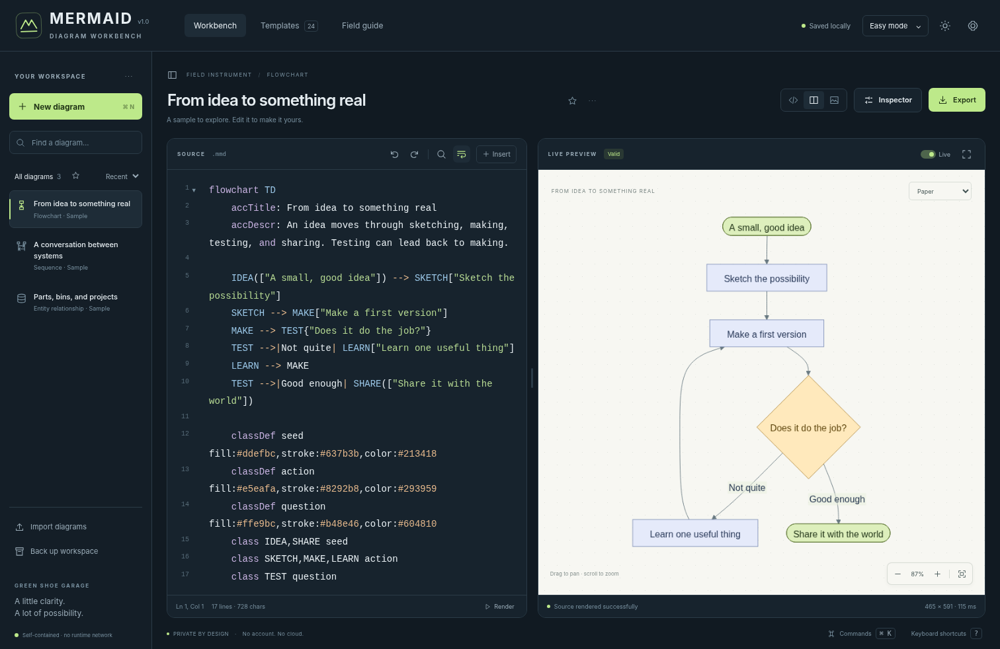
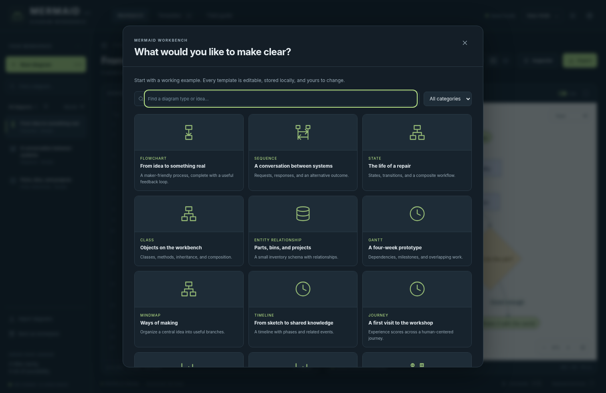
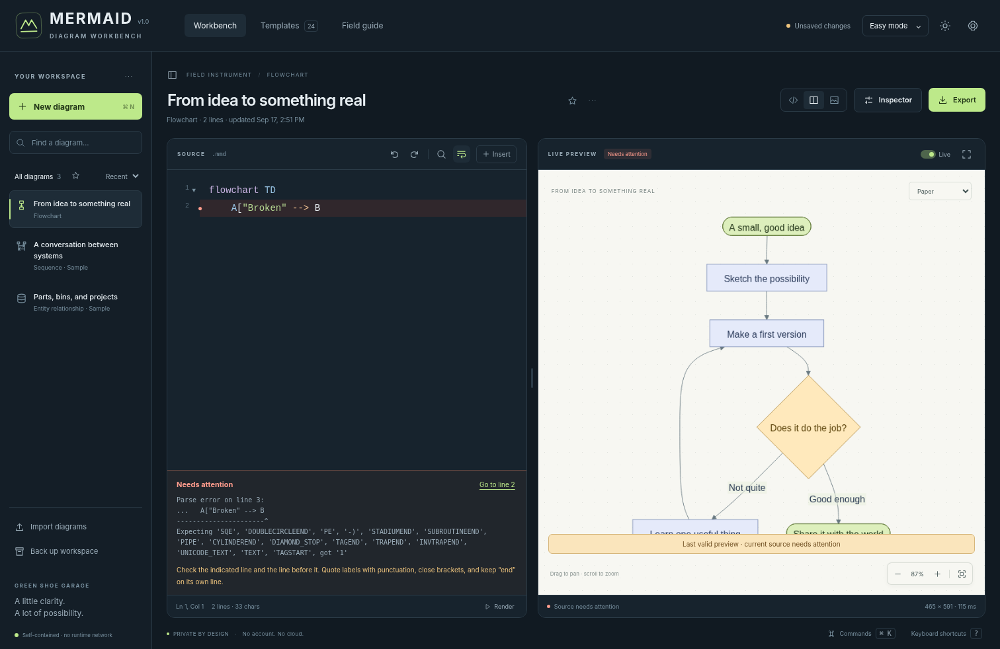
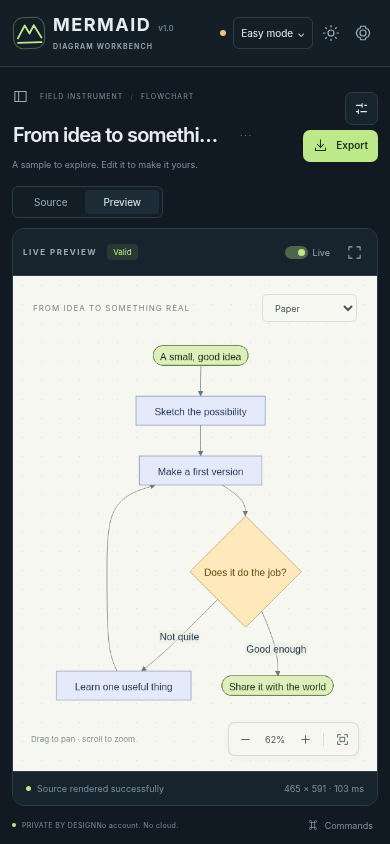

# MERMAID · Diagram Workbench

**Green Shoe Garage · Field Instrument · v1.0.0**

A local-first Mermaid diagram viewer and source editor. Write a little structure, see what it means, and take the result with you. No account, subscription, server application, CDN, telemetry, or external font is required.



## Start here

**The simplest option:** open `MERMAID-Workbench-v1.0.0.html` in a modern desktop browser. This is the self-contained edition: the editor, rendering engine, templates, styles, and third-party notices are embedded in that one file. It does not need an internet connection to render diagrams.

The ZIP also includes a conventional static website and its editable source. For that edition, serve `index.html` together with `renderer.html`, `assets/`, `vendor/`, and `src/`. Do not extract just `index.html`; it intentionally uses the adjacent files. Use the portable edition for double-click/file-based use.

For a local web-server origin, Python is one optional way to serve the extracted folder:

```sh
cd mermaid-workbench
python3 -m http.server 8000 --bind 127.0.0.1
```

Then open `http://127.0.0.1:8000/` in the browser. No Python packages, npm installation, or compilation are needed for normal use.

### Your first minute

1. Change a label in the sample diagram, or choose **New diagram** or **Templates**.
2. The preview updates automatically. Drag the canvas to pan, scroll to zoom, or press **F** while the canvas is focused to fit.
3. Select **Export** for a drawing or editable source. Use **Back up workspace** for an independent copy of all your diagrams and context.

A green save indicator means the workspace was saved in **this browser**, not uploaded or written back into an imported file. File-based storage behavior varies between browsers and file locations. **Keep workspace JSON backups.**

## The complete working loop

| Area | Included in v1.0.0 |
|---|---|
| Source editor | Syntax colors, line numbers, indentation, bracket matching, folding, undo/redo per diagram, find/replace, comments, snippets, completion, adjustable font size and line wrap |
| Live viewer | Debounced rendering, manual-render mode, pan, pointer-centered zoom, fit/reset, keyboard navigation, presentation view, resizable source/preview split |
| Error recovery | Source remains editable; line hints and parser details; last-valid preview survives failed edits; outdated image exports require explicit permission |
| Workspace | Multiple diagrams, title/source/tag/collection search, favorites, sort by recency/title/type, duplication, delete confirmation and session undo |
| Guided editing | Add named flowchart nodes, choose a shape, connect explicit nodes, choose connector/direction, and jump to simple node declarations |
| Appearance | Five diagram palettes, clean/hand-drawn look for supported types, flowchart connector styles, dot-grid toggle, advanced diagram configuration |
| History | Named snapshots, automatic checkpoints on document switches when eligible, source comparison, selected baseline, restore with a pre-restore snapshot |
| Context | Notes, collection and tags; Advanced mode adds assumptions, evidence, and findings with severity, confidence, and open/resolved status |
| Portability | Source and image exports, editable JSON, whole-workspace ZIP, standalone HTML reports, browser print/PDF reports |
| Accessibility | Semantic controls, keyboard shortcuts, visible focus, accessible labels, dark/light/high-contrast themes, reduced-motion support, responsive mobile source/preview tabs |
| Privacy | Local execution and storage; isolated rendering frame; no telemetry or account; no automatic upload, cloud conversion, or runtime CDN |

**This is a text-first diagram editor, not a free-position drawing program.** Mermaid controls layout. Guided node/connection controls apply to flowcharts; every supported diagram type remains editable through its source. The outline is deliberately conservative, not a full Mermaid abstract-syntax-tree editor.

## Templates

There are **24 starting points**, including flowcharts, sequence diagrams, state machines, class diagrams, entity relationships, Gantt schedules, mindmaps, timelines, user journeys, pie charts, quadrant charts, Git histories, requirements, C4 context, Sankey flows, XY charts, blocks, packets, architecture, Kanban, radar, treemaps, subgraphs, and a blank flowchart.

The template data is illustrative. It is not evidence for a real project. Three examples appear in a new workspace; editing a sample makes it your own. **Clear sample data** removes only samples that have not been edited. **Fresh Start** removes everything in the workspace only after typed confirmation and does not add samples again.



## Import and export

### Import

Use the import button or drop files onto the workbench. Accepted formats:

- `.mmd`, `.mermaid`, and `.txt`: editable Mermaid source.
- `.md` and `.markdown`: extract each fenced Mermaid block into a diagram.
- `.json`: a Workbench workspace, a diagram containing `source`, or Mermaid Live-style JSON containing `code`.
- `.svg`: recover editable Mermaid **only when the SVG includes Workbench source metadata**.

Ordinary imports add independent copies. A workspace backup opens a choice between **Add diagrams as copies** and an explicitly confirmed **Restore whole workspace**. Invalid imports do not replace the current workspace. A generic image or arbitrary SVG cannot be converted back into Mermaid by this application.

### Export

| Format | What it retains |
|---|---|
| Mermaid `.mmd` | Current editable source only |
| Markdown `.md` | Title and a fenced Mermaid source block |
| SVG | Scalable drawing; optional background and optional embedded source/title/appearance |
| PNG | Raster image at 1×–4×; optional transparent background; no embedded Mermaid source |
| Diagram JSON | Source, appearance, notes, findings, history, baseline, and metadata |
| Workspace JSON | All diagrams, history, review context, settings, and active selection |
| Workspace ZIP | Workspace JSON, every individual `.mmd`, every diagram JSON, and an archive README |
| Standalone HTML report | Fixed diagram image, notes, assumptions/evidence/findings, baseline summary, optional source; no runtime dependencies |
| Print / PDF report | The report through the browser’s print dialog; choose its Save as PDF option where available |

**SVG source embedding is enabled by default.** Turn it off when sharing a drawing without its editable source. Backups and exports are not encrypted. The workspace ZIP exports sources and JSON; it does not batch-render every diagram to images.

When the source or appearance no longer matches the preview, SVG and PNG are disabled until you render successfully or explicitly approve exporting the **last valid preview**. That export is marked `-last-valid`, and embedded SVG metadata describes the preview actually exported—not the broken current source. Reports also label outdated previews and can include both versions of the source.



## Keeping work safe

Autosave uses browser `localStorage`. Its status distinguishes unsaved, saving, saved, and failed/paused saves. The app retains a best-effort prior browser checkpoint; that checkpoint shares the same storage limits and is **not** an independent backup.

If storage is denied, the workbench still renders and edits in the open tab, but shows an export warning. If quota is exhausted, source stays in memory and the save-failure alert remains until a successful retry. Corrupt stored data is not silently overwritten; it can be downloaded for recovery. A changed revision from another tab pauses saving and offers backup, explicit reload, or merge-as-copies.

Snapshots preserve source and appearance, not the entire history of every notes field. A workspace or diagram JSON backup preserves current notes and registers. Undo/redo is separate and lasts for the current session. Up to 25 snapshots are retained per diagram; the selected baseline is protected from normal snapshot pruning.

## Keyboard essentials

| Shortcut | Action |
|---|---|
| Ctrl/Cmd + N | New diagram |
| Ctrl/Cmd + O | Import |
| Ctrl/Cmd + S | Export current source |
| Ctrl/Cmd + Shift + S | Export workspace JSON backup |
| Ctrl/Cmd + E | Export dialog |
| Ctrl/Cmd + Enter | Render now |
| Ctrl/Cmd + K | Command palette |
| Ctrl + Space | Source completion |
| Ctrl/Cmd + / | Toggle source comments |
| Ctrl/Cmd + F | Find in source when the editor is focused |
| Ctrl/Cmd + Z | Undo in source |
| F / 0 | Fit / actual-size view while the canvas is focused |
| + / −, arrow keys | Zoom / pan while the canvas is focused |
| Escape | Leave presentation view, dismiss a dialog, or release editor focus |
| ? | Shortcut reference when not typing |

The in-app Field guide and command palette remain available without the internet. Its optional link to upstream Mermaid documentation opens only when selected.

## Static hosting

Upload these paths together, preserving their relative structure:

```text
index.html
renderer.html
manifest.webmanifest
sw.js
assets/
vendor/
src/
licenses/
```

Everything uses relative URLs, so a subdirectory such as `/mermaid/` works without rewriting code. Include `manifest.webmanifest` and `sw.js` for the hosted offline-cache/installable-app path. HTTPS, or a browser-recognized localhost origin, is required for service workers. Wait for **Offline app cache is ready** after the first complete online load before relying on that cache.

Do not mix files from different releases. Back up your workspace before replacing a hosted release. The worker caches only its own known application assets and cleans up old caches only within this app’s path. The portable HTML edition does not need or install a service worker.

There is no backend or database to configure, and nothing in this package has been published to your website or GitHub automatically. Normal web-server access logs may exist on whichever host you choose; the application does not transmit diagram content to that server.

## Engine, limits, and deliberate boundaries

This release pins **Mermaid 11.12.2**, CodeMirror **5.58.3**, and JSZip **3.10.1**. It does not claim compatibility with every feature in newer Mermaid versions. `vendor/provenance.json` records the local rendering-bundle provenance and transformations; exact transitive package versions were not all recoverable from the source distribution.

The application locks strict security, disables external diagram images/links, isolates rendering in a sandboxed iframe, strips active content from the exported SVG, and displays diagrams as images. Small built-in raster icons are retained for diagrams such as C4. Rich HTML labels are reduced to plain SVG text; specialized HTML/math formatting may not be preserved. These controls are defense in depth, not a security certification or a guarantee against every hostile input.

Optional **ELK**, **ZenUML**, and third-party icon packs are not bundled. Dagre is the default where applicable; Mermaid’s built-in type-specific layout engines handle other families. Hand-drawn style and curve options do not apply identically to all types. Mermaid may ignore a subgraph’s requested direction when its nodes connect outside the subgraph; source-level appearance directives can override palette choices.

Safety limits: 100 diagrams per workspace, 120,000 source characters per diagram, 1,200 Mermaid edges where enforced by the engine, 25 snapshots per diagram, 100 findings per diagram, 12 MB per imported file, and PNG canvases no larger than 16,384 pixels per dimension or 40 million pixels in total. Browser storage may fill before those limits. Split very large diagrams into smaller views or use SVG instead of a large raster export. The 15-second renderer watchdog is not guaranteed to interrupt JavaScript that blocks the browser process.

## Verification

The included regression evidence records **38 Node assertions**, **62 browser workflow assertions**, and **129 renderer fixtures**. The renderer matrix includes all 24 templates in all five palettes, image decoding, security/error cases, Unicode labels, and a 200-node chain. The UI suite exercises real sandbox rendering, source editing, recovery, guided nodes/edges, history, context, imports, SVG/PNG/ZIP/report generation, and responsive layouts.

The test environment did not permit ordinary browser navigation to a local origin, so UI tests used an `about:blank` document with explicitly documented storage/download shims. The real denied-storage path was also exercised without a storage shim. **Actual origin persistence across browser restarts, service-worker installation/offline reopening, native save/print dialogs, Safari/Firefox, and physical mobile devices remain unverified here.** Read [the full test report](docs/TEST-REPORT.md) before treating this as a validated deployment on a particular platform.



## Source and maintenance

```text
src/core.js          Pure data model, validation, import parsing, snapshots, comparison
src/app.js           UI, source editor, workspace persistence, viewport, import/export
src/renderer.js      Isolated Mermaid configuration, rendering, SVG cleanup
src/templates.js     Original template library
assets/app.css       Application, responsive, contrast, and print styles
vendor/              Checked-in runtime libraries; no installation needed
scripts/             Optional release builder and vendor-recovery script
tests/               Node and Playwright regressions and recorded results
examples/            Editable .mmd versions of every template
licenses/            Third-party notices and applicable license texts
```

To rebuild the portable edition after editing the static source, use Python 3.9+:

```sh
python3 scripts/build_release.py
```

To run pure-data and static-cache tests, use Node 18+:

```sh
node --test tests/*.test.cjs
```

Browser tests are development-only and require Python Playwright and a Chromium browser. They are not runtime dependencies:

```sh
python3 tests/browser.test.py
python3 tests/renderer.test.py
# Or select a Chromium executable already installed on your system:
CHROMIUM=/path/to/chromium python3 tests/browser.test.py
```

Do not run `prepare-local-vendor.cjs` for normal use. It is the recorded recovery procedure for the specific Gradio 6.5.1 frontend distribution used to assemble this pinned bundle. It requires those matching input assets and TypeScript; it is not a general Mermaid updater. See [architecture and maintenance](docs/ARCHITECTURE.md).

The original workbench code is MIT-licensed. Third-party components retain their licenses and attribution. This is an independent workbench using Mermaid, not an official Mermaid or Mermaid Chart product.
